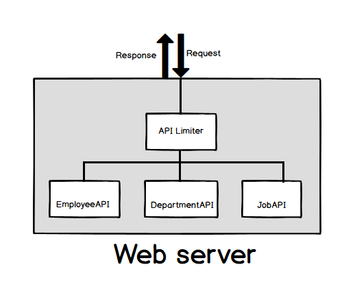
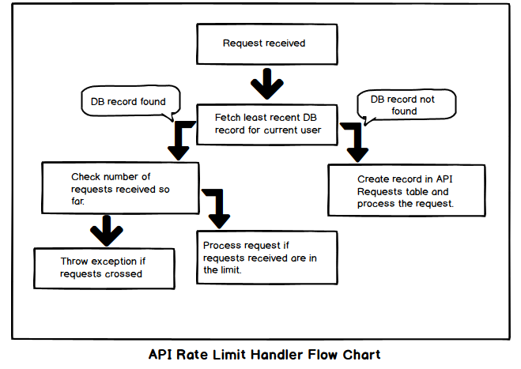

# Design-API-rate-limiter

Problem statement:
------------------
Design and write classes need to implement api rate limiter. List out the data structures and design patterns needed for this implementation.

For example rate limiter should allow only 50 reqs/sec for free plan user, 500 reqs/sec for standard plan user and 1000 reqs/sec for pro plan user. Rate limiter should throw error for each REQUEST beyond this rate limit for each SECOND.

Note: This is not complete design and this design is theoritacal and not implemented practically.

Solution:
----------
- When I first had to think solution for this problem, below was my approach. Using instance of API rate limiter in every resource before processing the request.
  
- We can have better design than above discussed one. The idea is to send all requests through API rate limit handler and processing further. This sounds like using interceptor design pattern.
  
- As shown in above image, all requests will pass through rate limit handler. So for every request we can verify how many requests this user has sent in last one second, minute or hour based on user plan.
- We should use some kind of storage mechanism to count the number of requests/duration. Below is the sample table schema looks like.
  
- In the schema, start time and end time are the boundaries for requests. It means let's say a user is in free plan that means from the problem statement we should allow only 50 reqs/sec. So start and end time will be differ by 1000 milli secs. 
- We'll have our logic like when API rate limiter receives a request if checks in the database for a record which is least recent  in start time having empty end time for the current user. If it found then validates the number of requests and proceeds further if limit is not reached else throws exception.
  
