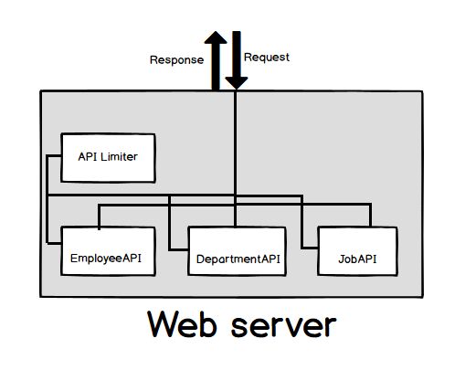

# Design-API-rate-limiter

Problem statement:
------------------
Design and write classes need to implement api rate limiter. List out the data structures and design patterns needed for this implementation.

For example rate limiter should allow only 50 reqs/sec for free plan user, 500 reqs/sec for standard plan user and 1000 reqs/sec for pro plan user. Rate limiter should throw error for each REQUEST beyond this rate limit for each SECOND.

Note: This is not complete design and this design is theoritacal and not implemented practically.

Solution:
----------
- When I first had to think solution for this problem, below was my approach.
  
